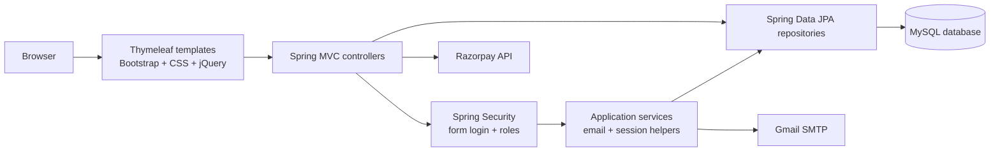
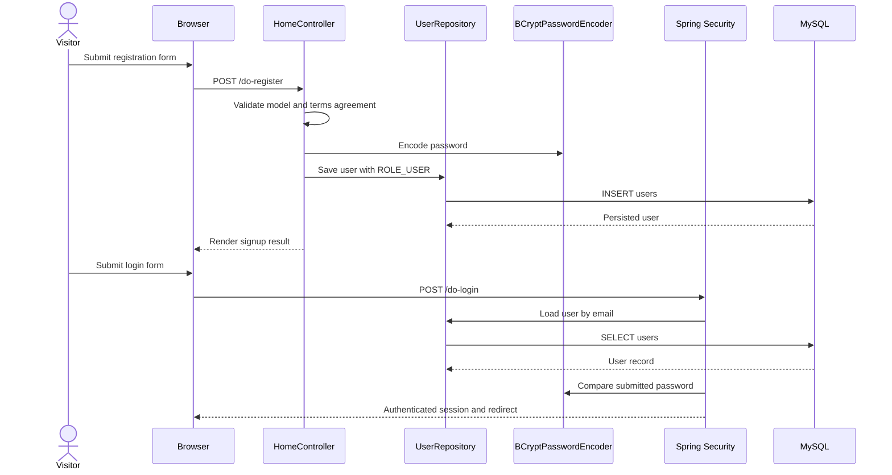
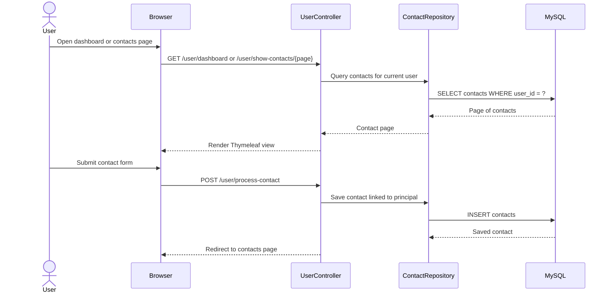
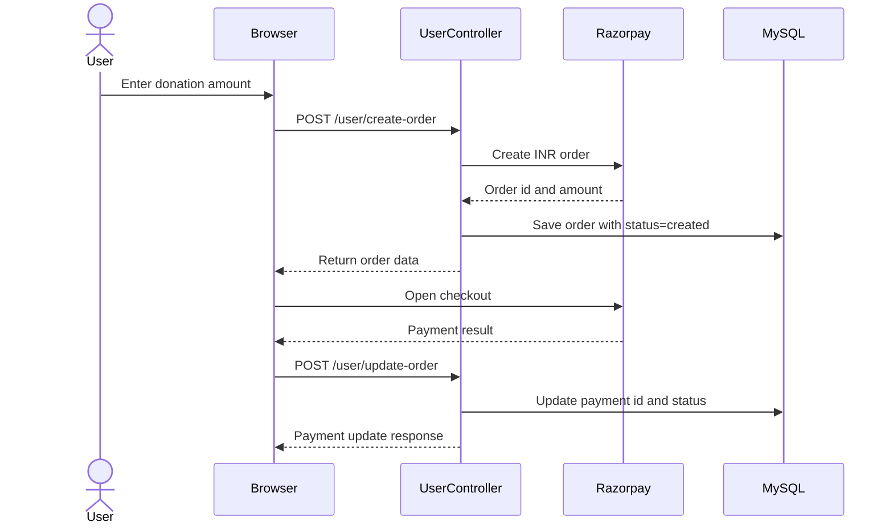
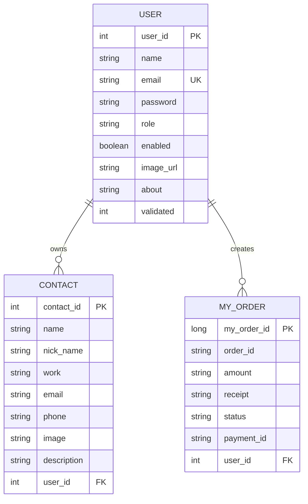

# Smart Contact Manager

Smart Contact Manager is a Spring Boot web application for keeping personal contacts in one place. Users can manage their contacts and profile, while administrators can manage users and send notifications. The project also includes email OTP flows and a Razorpay payment flow.

> **Before deploying**
>
> The application currently has database, SMTP, and payment settings in source/configuration files. Move these values to environment variables or a secrets manager, and rotate any credentials that have previously been committed.

## Contents

- [Capabilities](#capabilities)
- [Architecture](#architecture)
- [Application flows](#application-flows)
- [Domain model](#domain-model)
- [Project structure](#project-structure)
- [Technology stack](#technology-stack)
- [Prerequisites](#prerequisites)
- [Configuration](#configuration)
- [Run locally](#run-locally)
- [Docker](#docker)
- [Main routes](#main-routes)
- [Testing](#testing)
- [Production readiness](#production-readiness)

## Capabilities

### Public

- Home and about pages
- User registration with validation
- Sign in and sign out through Spring Security form login
- Forgot-password and email-verification OTP flows

### Authenticated users

- User dashboard
- Create, view, search, edit, and delete contacts
- Paginated contact listing
- Contact profile/details view
- Profile and profile-image updates
- Password change
- Razorpay order creation and payment-status update

### Administrators

- Paginated administrator dashboard
- Search and inspect users
- Delete users and their related contacts/orders
- Send notification emails to users

## Architecture



The application is a monolithic Spring Boot service. Thymeleaf renders HTML on the server, while small JavaScript helpers provide live search and payment interactions. Controllers coordinate request handling, repositories persist JPA entities, and Spring Security restricts `/user/**` and `/admin/**` routes.

### Layer responsibilities

| Layer | Location | Responsibility |
|---|---|---|
| Web/controllers | `smartcontactmanager/src/main/java/com/smartcontact/manager/controller` | Routes, request parameters, view models, redirects |
| Security | `.../config` | User lookup, BCrypt password verification, role checks |
| Domain | `.../entities` | `User`, `Contact`, and `MyOrder` JPA entities |
| Persistence | `.../dao` | Spring Data repositories and search queries |
| Services/helpers | `.../service`, `.../helper` | SMTP delivery, flash/session messages |
| Views | `smartcontactmanager/src/main/resources/templates` | Thymeleaf pages for public, user, and admin areas |
| Static assets | `smartcontactmanager/src/main/resources/static` | CSS, JavaScript, images, and UI walkthrough assets |

## Application flows

### Authentication and registration



### Contact lifecycle



### Payment flow



## Domain model



`User.contacts` is a lazy, cascading one-to-many relationship. `Contact.user` and `MyOrder.user` are many-to-one relationships back to the owning user. Contact JSON serialization ignores the back-reference to prevent recursive serialization.

## Project structure

```text
smartcontactmanager/
├── pom.xml
├── Dockerfile
├── mvnw
├── mvnw.cmd
└── src/
    ├── main/
    │   ├── java/com/smartcontact/manager/
    │   │   ├── SmartcontactmanagerApplication.java
    │   │   ├── config/       # Spring Security and UserDetails
    │   │   ├── controller/   # MVC controllers and route handlers
    │   │   ├── dao/          # Spring Data JPA repositories
    │   │   ├── entities/     # User, Contact, MyOrder
    │   │   ├── helper/       # Session messages and helpers
    │   │   └── service/      # Email service
    │   └── resources/
    │       ├── application.properties
    │       ├── templates/    # Thymeleaf views
    │       └── static/       # CSS, JS, and images
    └── test/java/             # Spring context test
```

## Technology stack

- Java 17
- Spring Boot 3.2.3
- Spring MVC and Thymeleaf
- Spring Security 6
- Spring Data JPA / Hibernate
- MySQL
- BCrypt password hashing
- Jakarta Bean Validation
- JavaMail SMTP
- Razorpay Java SDK
- Maven Wrapper
- Docker

## Prerequisites

- JDK 17+
- MySQL 8+
- Maven 3.8+ or the included Maven Wrapper
- Docker, if using the container workflow
- SMTP credentials for OTP and notification email
- Razorpay test/live credentials for payment functionality

Create the database before starting:

```sql
CREATE DATABASE sma CHARACTER SET utf8mb4 COLLATE utf8mb4_unicode_ci;
```

## Configuration

The current application reads database settings from `smartcontactmanager/src/main/resources/application.properties`. For a safe deployment, replace literal values with environment variables or an external secrets manager:

```properties
spring.datasource.url=${DB_URL:jdbc:mysql://localhost:3306/sma}
spring.datasource.username=${DB_USERNAME:root}
spring.datasource.password=${DB_PASSWORD}
spring.jpa.hibernate.ddl-auto=${JPA_DDL_AUTO:validate}
server.port=${SERVER_PORT:8080}
```

SMTP and Razorpay values should also be supplied through environment variables. Do not commit passwords, app passwords, API secrets, or private keys.

## Run locally

From the repository root, enter the application directory first:

```bash
cd smartcontactmanager
./mvnw spring-boot:run
```

On Windows:

```powershell
cd smartcontactmanager
\.mvnw.cmd spring-boot:run
```

The default server address is `http://localhost:8080`.

Useful pages include:

- `/` — home
- `/about` — about page
- `/signup` — registration
- `/signin` — login
- `/user/dashboard` — authenticated user dashboard
- `/user/show-contacts/0` — paginated contacts
- `/admin/dashboard/0` — administrator dashboard

## Docker

Build and run the application image from the `smartcontactmanager` directory:

```bash
cd smartcontactmanager
docker build -t smart-contact-manager .
docker run --rm -p 8080:8080 \
  -e DB_URL=jdbc:mysql://host.docker.internal:3306/sma \
  -e DB_USERNAME=root \
  -e DB_PASSWORD=change-me \
  smart-contact-manager
```

The included `Dockerfile` builds the Maven artifact and runs it on Java 17. The database remains an external service.

## Main routes

| Area | Method | Route | Description |
|---|---:|---|---|
| Public | GET | `/`, `/about` | Public pages |
| Auth | GET/POST | `/signup`, `/do-register` | Registration |
| Auth | GET/POST | `/signin`, `/do-login` | Form login |
| Auth | GET/POST | `/forgot-password`, `/send-otp` | Password reset OTP |
| Auth | GET/POST | `/verify-email`, `/send-otp-to-email` | Email verification flow |
| User | GET | `/user/dashboard` | User workspace |
| User | GET | `/user/show-contacts/{page}` | Paginated contacts |
| User | POST | `/user/process-contact` | Create contact |
| User | POST | `/user/process-contact-update` | Update contact |
| User | GET | `/user/delete/{cid}` | Delete contact |
| User | GET/POST | `/user/profile`, `/user/process-update-profile` | Profile management |
| User | POST | `/user/change-password` | Change password |
| User | POST | `/user/create-order` | Create Razorpay order |
| User | POST | `/user/update-order` | Persist payment result |
| Admin | GET | `/admin/dashboard/{page}` | Paginated user administration |
| Admin | GET | `/admin/user-profile/{uid}` | Inspect user |
| Admin | GET | `/admin/user-delete/{uid}` | Delete user and related records |
| Admin | POST | `/admin/send-email-user/{user_id}` | Send user notification |
| Search | GET | `/search/{query}` | Search contacts |
| Search | GET | `/search-user/{query}` | Search users |

## Testing

Run the current test suite from `smartcontactmanager`:

```bash
cd smartcontactmanager
./mvnw test
```

The repository currently contains a Spring context smoke test. Add controller, repository, security, payment, and service integration tests before treating the application as production-ready.

## Production readiness

Before deployment:

- [ ] Rotate all database, SMTP, and payment credentials that were ever committed.
- [ ] Load secrets from environment variables or a managed secret store.
- [ ] Remove `spring.jpa.show-sql=true` and use `ddl-auto=validate` or migrations.
- [ ] Enable HTTPS and secure session cookies.
- [ ] Re-enable and configure CSRF protection for browser form sessions.
- [ ] Add login throttling, account lockout, and audit logging.
- [ ] Verify the email-validation state is enforced during authentication; the current `UserDetailsServiceImpl` contains the validation check as commented code.
- [ ] Validate and sanitize uploaded image names and store uploads outside the packaged classpath.
- [ ] Verify Razorpay signatures server-side before marking orders as paid.
- [ ] Avoid logging passwords, OTPs, SMTP debug output, or payment secrets.
- [ ] Configure structured logs, health checks, metrics, backups, and database migrations.
- [ ] Add automated tests for authorization boundaries and data ownership.
- [ ] Add a reverse proxy and restrict database/network access to trusted services.

## UI walkthrough assets

The repository includes feature walkthrough animations under `smartcontactmanager/src/main/resources/static/img/`, including:

- [Registration](smartcontactmanager/src/main/resources/static/img/signup.gif)
- [Login](smartcontactmanager/src/main/resources/static/img/login.gif)
- [Contact management](smartcontactmanager/src/main/resources/static/img/add_contact.gif)
- [Admin panel](smartcontactmanager/src/main/resources/static/img/admin_panel.gif)
- [Payment integration](smartcontactmanager/src/main/resources/static/img/payment_gateway_integration.gif)
